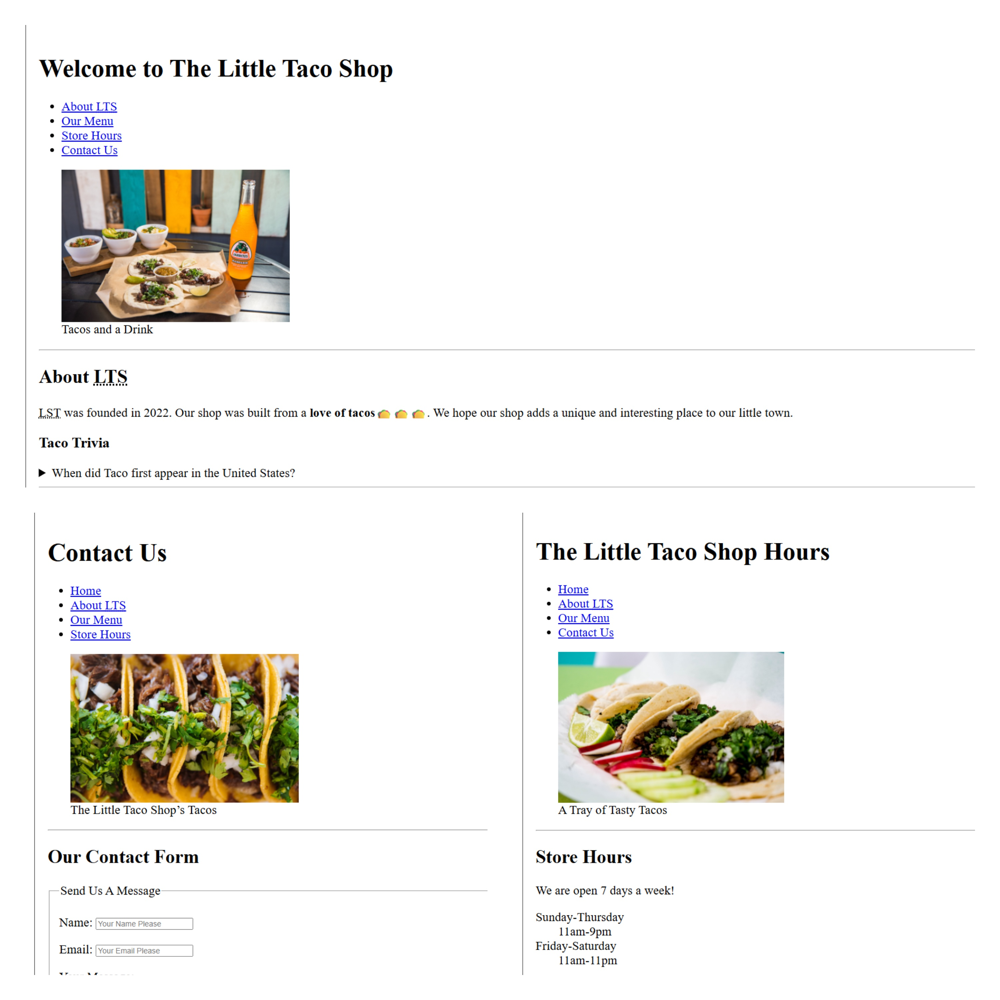

# 🌮 The Little Taco Shop

- A professionally structured, and complete-responsive **multi-page static website** built using **semantic HTML and CSS**.

---

## 📖 Description

- **The Little Taco Shop** website is my learning project, in which I learnt about semantic HTML and modular CSS from the available resources.

- This repository is made with simple HTML and CSS with future scope for the JavaScript integrationl.

---

## 📸 Preview


---

## ✨ Features

- Multi-page website (Home Page, Store Hours Page, Contact Page).
- Semantic **HTML5 structure** for clarity and accessibility used.
- Modular and maintainable CSS integration
- Accessibility-focused markup (`nav`, `figure`, `abbr`, `details`, `form labels`) used.

---

## 🗂️ Project Structure
```
├── index.html          # Home page
├── hours.html          # Store hours page
├── contact.html        # Contact page
├── css/
│   └── style.css       # Website styles
└── images/             # Website images
```

## 🧠 What I Learned

- Writing semantic and accessible HTML
- Structuring and maintaining a multi-page website
- Proper usage of tables, forms, images, and definition lists
- Accessibility best practices using labels and meaningful markup

## 🛠️ Technologies Used

- HTML
- CSS

## 🔮 Future Enhancements

- JavaScript-based interactivity
- Backend integration for contact form submissions

## 👨‍💻 Built by **Hardik Mahajan**
With 💖, attention to detail, best practices, and a passion for clean web development.
